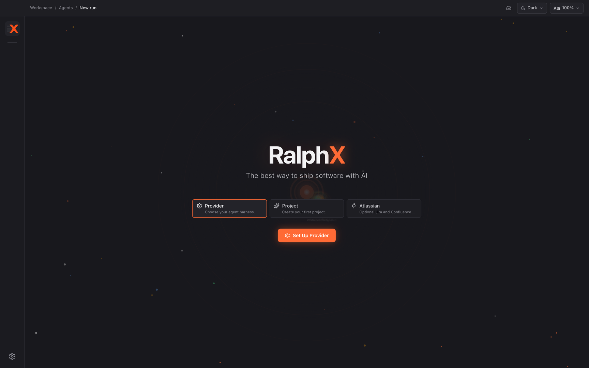
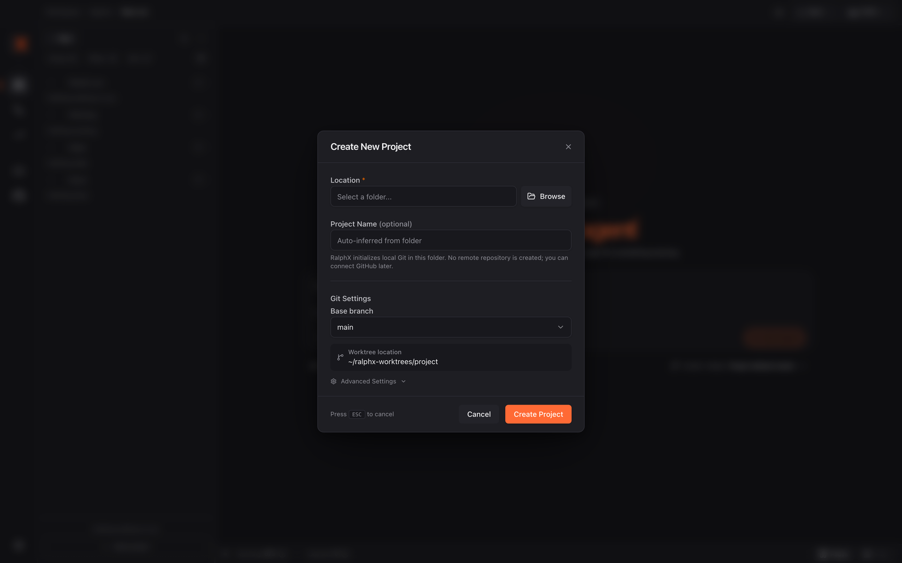

# Installing RalphX and running it for the first time

Install the signed Mac app, connect an authenticated agent runtime, and create the first project workspace RalphX will use for your conversations. At the end, you will have RalphX open with a project ready for the next guide.

**Before you start:** nothing — this is the first guide

## Check the requirements

1. Confirm that your Mac runs macOS 13 Ventura or later.

2. Choose one supported agent runtime: the Claude CLI or the Codex CLI.

3. Install your chosen CLI by following its official instructions: [Claude CLI](https://docs.anthropic.com/en/docs/claude-code) or [Codex CLI](https://developers.openai.com/codex/cli).

4. Authenticate the CLI in Terminal before opening RalphX.

5. Keep the authenticated CLI available on your Mac; RalphX needs an installed, authenticated runtime to run agents.

6. If you are contributing to RalphX rather than installing the app, use the [build-from-source guide](../development/build-from-source.md).

## Install RalphX with Homebrew

1. Open Terminal.

2. Add the RalphX Homebrew tap:

   ```sh
   brew tap aigentive/ralphx
   ```

3. Install the signed RalphX app:

   ```sh
   brew install --cask ralphx
   ```

4. Wait for Homebrew to finish installing the app.

5. Open RalphX from Applications or Spotlight.

6. Use the [Homebrew installation guide](../install/homebrew.md) later for upgrades, stale tap metadata, repair, or uninstalling.

## Use the signed release instead

1. If you do not use Homebrew, open the [RalphX GitHub Releases page](https://github.com/aigentive/ralphx.app/releases).

2. Download the signed build for your Mac.

3. Install the downloaded app in Applications.

4. Open RalphX.

5. Return to the Homebrew instructions above if you prefer Homebrew to manage future upgrades.

## Set up your provider

1. Open RalphX for the first time.

2. Find the **Provider** step on the welcome screen.



3. Click **Set Up Provider** when RalphX asks you to choose an agent harness.

4. Select the provider that matches the CLI you installed and authenticated.

5. Complete the provider setup shown by RalphX.

6. Return to the welcome screen after the provider is ready.

7. Confirm that the **Provider** step now shows that your agent harness is ready.

8. Do not continue until RalphX can see an authenticated provider; agent work cannot start without one.

## Start your first project

1. Find the **Project** step on the welcome screen.

2. Click **Start Your First Project**.

3. Read the **Create New Project** dialog before choosing a folder.



4. Use a folder for the project you want RalphX to work with.

5. Keep your current working directory separate from the worktrees RalphX creates for agent work.

## Choose the project location

1. Find **Location** in the project dialog.

2. Click **Browse**.

3. Choose the local folder that contains the project RalphX should use.

4. Confirm the chosen folder in **Location**.

5. Use a folder you can access and that has the project files you want to discuss or change.

6. Let RalphX inspect the folder before moving to the Git settings.

## Name the project

1. Review the **Project Name** field.

2. Leave the optional name empty to let RalphX infer it from the selected folder.

3. Enter a short name if you want a different project label in RalphX.

4. Keep the name recognizable; it helps you distinguish workspaces later.

5. Continue when the project name matches the workspace you want to create.

## Choose Git settings

1. Find the **Git Settings** section.

2. Open **Base branch**.

3. Select the branch that should be the starting point for RalphX work.

4. Choose the branch your team normally uses as the integration branch.

5. Review the displayed worktree location.

6. RalphX uses that location for isolated agent work instead of changing your active working directory.

7. Keep the default if it is suitable for your Mac and available disk space.

## Choose the worktree parent directory

1. Open **Advanced Settings**.

2. Find **Worktree Parent Directory**.

3. Keep the default directory if you do not need a different location.

4. Change it only when you need RalphX worktrees on another local volume or in an organization-approved directory.

5. Choose a directory with enough space for project worktrees.

6. Remember the location if you want to inspect generated worktrees outside RalphX later.

7. Leave the advanced section when the worktree parent directory is correct.

## Create the workspace

1. Recheck **Location**.

2. Recheck **Base branch**.

3. Recheck **Worktree Parent Directory** if you changed it.

4. Click **Create Project**.

5. Wait while RalphX creates the project workspace.

6. Do not close RalphX while project creation is in progress.

7. Return to the welcome screen when creation finishes.

8. Confirm that the **Project** step reports that the project workspace is ready.

9. Click **Continue** when RalphX offers it after a project already exists.

10. Use **Cancel** only when you opened the project dialog outside the first-run flow and want to leave without creating a project.

## Optionally connect Atlassian

1. Find the **Atlassian** step on the welcome screen.

2. Treat this step as optional; it provides Jira and Confluence context when you choose to connect it.

3. Click **Atlassian** only if you want to set up that integration now.

4. Complete the integration flow shown by RalphX.

5. Skip it for now if you do not need Atlassian context.

6. Return later through Settings → **Integrations** → **Atlassian** when you want to connect it.

## What you have now

RalphX is installed on your Mac and has an authenticated agent provider available. You also have a project workspace with a selected base branch and a worktree parent directory for isolated agent work. The optional Atlassian connection is either configured or safely left for later.

## Next

- [Finding your way around](02-tour-of-the-app.md)
