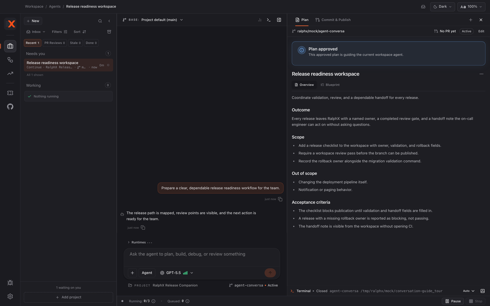
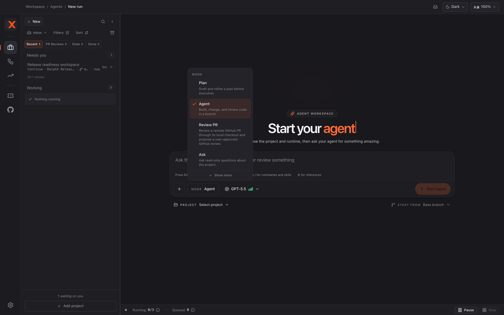
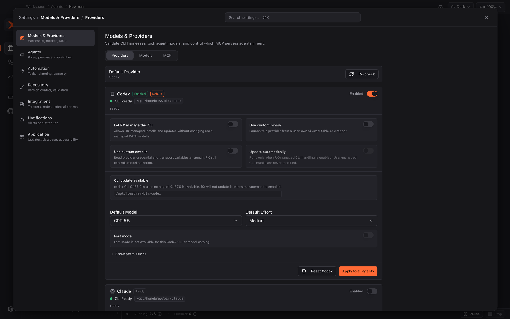

# Finding your way around

Learn where RalphX keeps conversations, artifacts, navigation, start modes, and settings, so you can begin work without guessing. At the end you will know which workspace to open, which mode to choose, and where to adjust the app.

**Before you start:** [Installing RalphX and running it for the first time](01-install-and-first-run.md)

## Start in the Agents workspace

1. Click **Agents** in the left navigation.

   This is where almost all of your time goes. Conversations, plans, reviews, and publishing all happen here; the other destinations are dashboards and settings around it.

2. Find the two halves of the workspace: the conversation on one side, the artifact pane on the other.

   The conversation is the transcript — what you and the agent said. The artifact pane holds what the agent *produced*: plans, review findings, the publish view. The transcript scrolls away; the artifacts stay.

   Agents work in isolated git worktrees and never touch your working directory. Whatever you have open and uncommitted stays exactly as you left it.

## Move around with the navigation rail

1. Use the rail on the left to switch destinations.

   Some entries appear only once the matching integration is connected, so a fresh install shows fewer than this list.

| Destination | What it is | When you see it |
|---|---|---|
| **Agents** | Conversations, plans, and agent-driven work | Always |
| **Automations** | Long-running, supervised goals across many PRs | Always |
| **Insights** | RalphX usage and activity insights | Always |
| **GitHub** | The connected GitHub view | Always |
| **Ticketing** | The ticketing dashboard | Once a ticket provider is connected |
| **Granola** | The Granola notes dashboard | Once Granola is connected |
| **Report Issue** | Report a problem with RalphX | Always, at the foot of the rail |
| **Settings** | App configuration | Always, at the foot of the rail |

2. Return to **Agents** whenever you want to resume a conversation.

## Choose a start mode

1. Start a new conversation from **Agents** and pick its mode.

   Pick the mode that matches your immediate goal rather than combining a question, a plan, and a code change in one conversation. Starting a second conversation is cheap, and a conversation with one goal is far easier to follow later.

| Mode | What it does | Use it when |
|---|---|---|
| **Plan** | Drafts and refines a plan before execution | You want agreement on the approach before any code changes |
| **Agent** | Builds, changes, and reviews code in a branch | You are ready for code work in an isolated worktree |
| **Review PR** | Reviews a remote GitHub PR through its local checkout and proposes a review you approve | You have a pull request to review |
| **Ask** | Answers read-only questions about the project | You want to understand something, not change it |
| **Automation** | Creates and runs a recurring agent workflow | You have a goal too large for one plan-and-implement cycle |
| **Persona** | Builds or refines a reusable agent persona | You want agents to write or reason in a particular style |

2. Start with **Plan**, **Agent**, **Review PR**, or **Ask**.

   These four are surfaced by default and cover ordinary work. **Automation** and **Persona** are for the two advanced paths and each has its own guide.

   **Ask** and **Persona** work without a project selected. The other four need one.

   One caution on **Automation**: its description says “recurring agent workflow”, which sounds like scheduling. It is not. Runs are sequential over a goal's ordered items — RalphX has no cron or time-based triggers.

## Read the artifact pane

1. Open the tab matching the stage the conversation has reached.

   Tabs appear as the conversation produces them, so a new conversation shows fewer than this list. If one is missing, the agent has not produced it yet.

| Tab | Holds |
|---|---|
| **Issues** | The issues artifact for the conversation |
| **Plan** | The plan bundle — see [RalphX concepts](concepts.md) |
| **Tasks** | Tracked delivery, including the **Graph** and **Kanban** views |
| **Review** | Workspace Review findings |
| **Commit & Publish** | The commit and publishing workflow |

2. Turn on **Enable Tasks** in Settings → **Automation** → **Tasks** before expecting the **Tasks** tab.

   Tasks is off by default, and the main path in these guides does not need it. [Tracked delivery with Tasks](advanced/task-managed-delivery.md) covers it when you do.

   **Graph** and **Kanban** are toggles *inside* the **Tasks** tab, not destinations in the navigation rail. This trips people up because other tools make them top-level views.

## Find the right settings

1. Click **Settings** at the foot of the navigation rail.

   It opens on **Providers**, which is also where you go when a configured agent runtime stops working.

2. Pick the destination holding the setting you want.

| Destination | Contains |
|---|---|
| **Models & Providers** | **Providers**, **Models**, **MCP** |
| **Agents** | **Roles**, **Personas**, **Capabilities** |
| **Automation** | **Tasks**, **Planning**, **Workspace**, **Capacity** |
| **Repository** | **Repository**, **Setup & Validation** |
| **Integrations** | **Atlassian**, **GitHub**, **Linear**, **ClickUp**, **Granola**, **API Keys**, **External MCP** |
| **Notifications** | How RalphX gets your attention |
| **Application** | **Updates**, **Database**, **Accessibility** |

   **Database** is where you control how long tool-call detail is kept and reclaim disk space, which is easy to miss under **Application**.

3. Change the one setting you came for, then return to **Agents**.

## What you have now

You know how to open the Agents workspace, choose a start mode that matches your goal, and read the artifacts a conversation produces. You also know that RalphX runs agent work in isolated git worktrees and leaves your working directory untouched, and where in Settings to find each group of options.

## Next

- [Planning a feature with RalphX](workflows/planning-a-feature.md)
