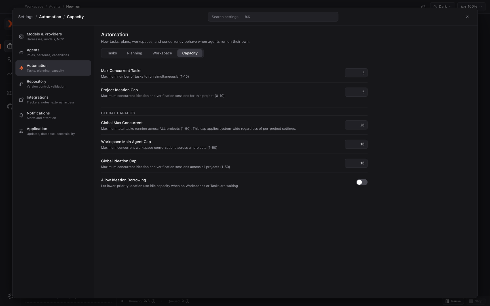

# Controlling how much runs at once

Choose limits that let RalphX finish work quickly without overwhelming your Mac. At the end, project, workspace, global, and ideation concurrency are tuned for the CPU, memory, disk space, and number of worktrees your machine can support.

**Before you start:** [Installing RalphX and running it for the first time](../01-install-and-first-run.md)

## Set project and global capacity

1. Open Settings → **Automation** → **Capacity**.

   This is where RalphX keeps every concurrency control.

2. Set **Max Concurrent Tasks** for this project.

   Its helper text is “Maximum number of tasks to run simultaneously (1-10).”

   This is the project-level limit for task execution.

   Start lower when the project has expensive builds, large dependency trees, or slow tests.

3. Set **Project Ideation Cap** for this project.

   Its helper text is “Maximum concurrent ideation and verification sessions for this project (0-10).”

   Set it to `0` when you want this project to reserve its capacity for execution rather than ideation and verification.

   Increase it only when parallel planning and verification leave enough room for the work you expect to run.

4. Set **Global Max Concurrent** for all projects.

   Its helper text is “Maximum total tasks running across ALL projects (1-50). This cap applies system-wide regardless of per-project settings.”

   This is the main ceiling that stops several projects from collectively overcommitting the Mac.

   Keep it at or below what the machine can run while builds and tests are active, not merely what it can run while agents are idle.

5. Set **Workspace Main Agent Cap** for all projects.

   Its helper text is “Maximum concurrent workspace conversations across all projects (1-50).”

   This bounds primary workspace conversations separately from the total task cap.

   Reduce it when concurrent main agents compete for memory or make disk-heavy worktree operations slow.

6. Set **Global Ideation Cap** for all projects.

   Its helper text is “Maximum concurrent ideation and verification sessions across all projects (1-50).”

   This prevents planning and verification activity across projects from growing without a machine-wide limit.

   Balance it against active implementation so one kind of work does not crowd out the other.

7. Choose whether to enable **Allow Ideation Borrowing**.

   Its helper text is “Let lower-priority ideation use idle capacity when no Workspaces or Tasks are waiting.”

   Enable it when you want idle capacity to keep ideation moving.

   Leave it off when predictable capacity for pending workspace or task work matters more than using every idle slot.

## Choose limits that fit your Mac

1. Start with a conservative number of parallel tasks.

   More parallel work can finish sooner when the tasks are independent.

   It also makes agents compete for CPU, memory, network bandwidth, and disk I/O at the same time.

   Raise **Max Concurrent Tasks** gradually after observing that builds, tests, and the app remain responsive.

2. Account for the worktree cost of every concurrent agent.

   Each concurrent agent needs its own worktree.

   That means another checkout, its generated files, and often another dependency installation or build output.

   Make sure the worktree parent directory has space before raising capacity.

3. Use global limits to protect a shared machine.

   The project limits control one project's demand.

   **Global Max Concurrent**, **Workspace Main Agent Cap**, and **Global Ideation Cap** control the combined demand from every project.

   Lower the global values first when several projects run on the same Mac and resource contention appears.

4. Tune ideation separately from implementation.

   Ideation and verification can be lighter than a full build, but they still consume model, CPU, memory, and disk resources.

   Set **Project Ideation Cap** and **Global Ideation Cap** according to how much parallel planning you actually want while implementation is underway.

## Review workspace publishing defaults

1. Open Settings → **Automation** → **Workspace** → **General**.

   These are the publishing defaults RalphX applies to new workspaces.

2. Review **Default Autofix CI & Reviews**.

   Its helper text is “RalphX monitors this PR for failing checks and review feedback, then publishes follow-up fixes from the workspace automatically.”

   This is a default for new agent conversations, not a concurrency limit.

3. Review **Default GitHub auto-merge**.

   Its helper text is “RalphX asks GitHub to merge the PR after required checks and review requirements pass.”

   This is also a publishing default for new agent conversations, not a concurrency limit.

   Keep these defaults separate from capacity decisions so a higher agent count does not accidentally change how work is published.

## What you have now

RalphX has project and machine-wide limits for tasks, workspace conversations, and ideation. The limits account for the fact that parallel agents finish independent work sooner but compete for the same CPU, memory, disk, and worktree space. Your Workspace defaults are reviewed separately from those execution limits.

## Next

- [Planning a feature](../workflows/planning-a-feature.md)
