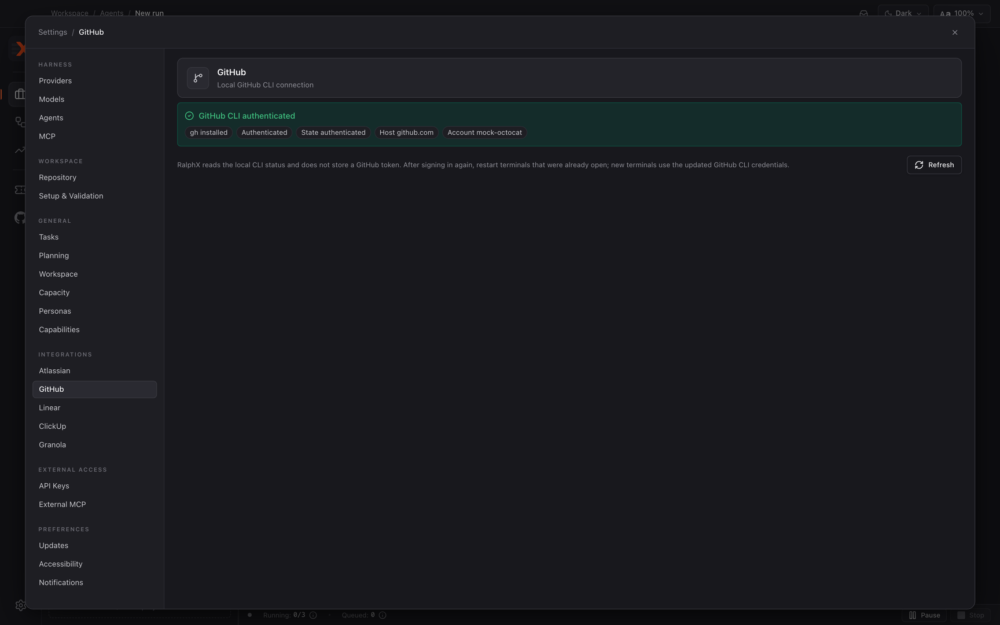

# Connecting RalphX to GitHub

Connect the GitHub CLI on your Mac so RalphX can use the GitHub account you already sign in to locally. At the end, RalphX can check GitHub access and use that local CLI session for GitHub-dependent work such as pull-request information and reviews.

**Before you start:** [Installing RalphX and running it for the first time](../01-install-and-first-run.md)

## Install and sign in to the GitHub CLI

1. Install the GitHub CLI (`gh`) on your Mac.

   RalphX uses the local GitHub CLI instead of asking you to paste a token into the app.

   RalphX stores no GitHub token.

   It reads the status of the `gh` CLI already installed on your Mac and uses its existing authentication.

   Install `gh` using GitHub's normal installation method for macOS.

   After installation, open a new terminal so it can find the command.

2. Run `gh auth login` in a terminal and complete the GitHub sign-in flow.

   Follow the prompts from the GitHub CLI.

   Sign in to the GitHub account you want RalphX to use.

   Complete any browser approval or device-code step that the CLI opens.

   Keep the terminal open until the command reports that sign-in is complete.

   You do not need to copy a token into RalphX.

3. Open a new terminal after the sign-in if you had terminals open already.

   New terminals use the updated GitHub CLI credentials.

   This helps when you also use terminals alongside RalphX for the same repository.

## Check the connection in RalphX

1. Open Settings → **Integrations** → **GitHub**.

   This is the one place in RalphX that shows the status of the local GitHub CLI connection.

   The page is a status check, not a token-entry form.

2. Click **Refresh** after the terminal sign-in completes.

   RalphX checks whether `gh` is installed and whether its current credential can be verified with GitHub.

   Use **Refresh** again after changing GitHub CLI authentication outside RalphX.

   If the status initially says that the CLI is unavailable, make sure `gh` is installed and available to newly opened terminals, then click **Refresh**.

3. Read the connection status and account details.

   A connected state shows “GitHub CLI authenticated.”

   It also shows that `gh` is installed, the active host, and the active GitHub account.

   For GitHub.com, the host is normally `github.com`.

   Confirm that the account shown is the one you expect RalphX to use.

## Understand a status that is not connected

1. Run `gh auth login` again when the page says “GitHub CLI not authenticated.”

   Then return to Settings → **Integrations** → **GitHub** and click **Refresh**.

   RalphX gives this guidance when `gh` is installed but does not have a usable local sign-in.

2. Re-authenticate when the page says “GitHub CLI credential rejected.”

   Your local GitHub CLI credential is present but GitHub did not accept it.

   Run `gh auth login` in a terminal, complete the flow, and click **Refresh** in RalphX.

3. Wait and retry when the page says “GitHub temporarily unavailable.”

   This means RalphX could not get a reliable response from GitHub at that moment.

   Click **Refresh** before starting another sign-in flow.

4. Retry the status check when the page says “GitHub access could not be verified.”

   This is a verification problem rather than proof that you need a new token.

   Click **Refresh** first.

   If it continues, run `gh auth login` in a terminal and complete the sign-in flow again.

5. Install `gh` when the page says “GitHub CLI unavailable.”

   RalphX cannot connect to GitHub through this page until the GitHub CLI is available.

   After installing it, run `gh auth login`, then return to RalphX and click **Refresh**.

## Know what works before you authenticate

1. Continue using local RalphX work without GitHub authentication when you do not need GitHub data or actions.

   RalphX can still work with your local repository, branches, workspaces, conversations, and artifacts.

   A GitHub sign-in is not required merely to open RalphX or work in a local repository.

2. Expect GitHub pull-request information to be unavailable until `gh` is authenticated.

   RalphX can still show local branch, workspace, and ticket-linked state when GitHub access is missing.

   It cannot fetch GitHub pull-request information without a usable local GitHub CLI credential.

   If you want to review a pull request with RalphX, complete the GitHub CLI sign-in first.

3. Treat GitHub CLI authentication as shared local setup.

   RalphX reuses the GitHub CLI session on your Mac.

   Other tools that use the same `gh` authentication may use that session too.

   RalphX does not keep a separate GitHub token that you can edit or remove in Settings.

## Remove the connection

1. Run `gh auth logout` in a terminal to sign the GitHub CLI out.

   The GitHub page in RalphX does not have a **Disconnect** control.

   The two-step **Disconnect** → **Confirm disconnect** or **Cancel** pattern is used by token-based integrations, but it does not apply to this GitHub panel because RalphX does not store GitHub credentials.

   Follow the GitHub CLI prompts to choose the account or host to sign out from when needed.

2. Return to Settings → **Integrations** → **GitHub** and click **Refresh**.

   RalphX should then report that the GitHub CLI is not authenticated.

   This confirms that RalphX no longer has a usable local GitHub CLI session for that account.

3. Run `gh auth login` again whenever you want to reconnect.

   Sign in through the GitHub CLI, then click **Refresh** in RalphX to check the new local session.

   You never need to remove or replace a GitHub token in RalphX because the app does not store one.

## What you have now

RalphX is connected to the GitHub account authenticated in your local `gh` CLI, or you know exactly why its status is not connected. The GitHub settings page shows the local CLI, host, and account status without storing a GitHub token in RalphX. You can now use GitHub-dependent pull-request information and review workflows when the status is authenticated.

## Next

- [Reviewing a pull request with RalphX](../workflows/reviewing-a-pull-request.md)
