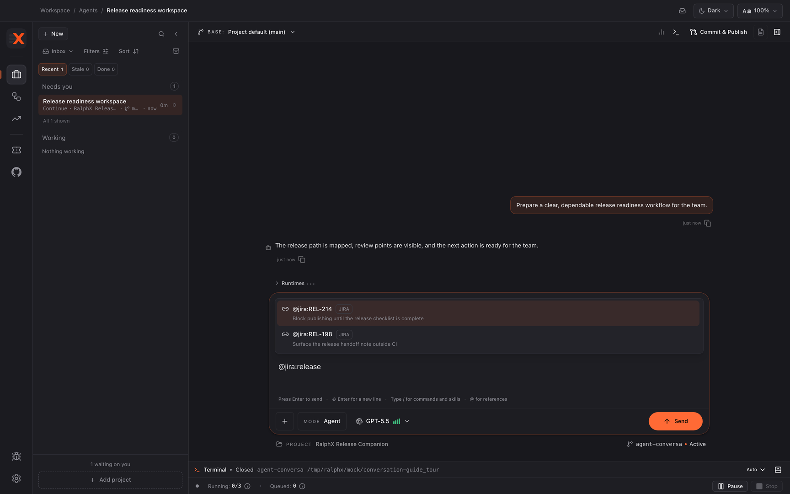
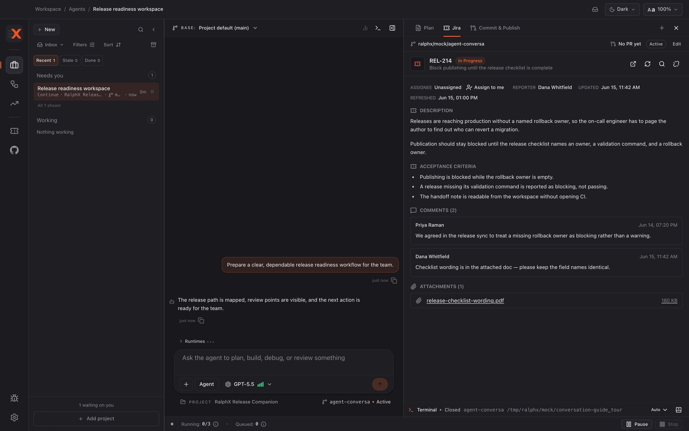

# Using Jira and Confluence in RalphX

Bring Jira issues and Confluence pages into a conversation so the agent plans and implements from the same ticket you do. You will finish with a conversation anchored to one Jira issue whose description, acceptance criteria, comments, and attachments stay visible beside the chat.

**Before you start:** [Connecting RalphX to Jira and Confluence](connect-jira-and-confluence.md)

## Attach a ticket from the composer

You do not need to know the issue key. Type `@jira:` followed by any word from the ticket and pick from the results.

1. Type `@jira:` in the composer, then a word from the issue title, such as `@jira:release`.
2. Pick the issue from the list that appears. It becomes a reference chip above the composer.

3. Type `@confluence:` — or the shorter `@conf:` — the same way for a Confluence page.
4. Use `@linear:`, `@clickup:`, or `@granola:` for those tools; only connected ones appear.
5. Click **+** beside the composer and choose a tool under **Integrations** to insert the same trigger without typing it.

If you already know the key, type it directly — `@jira:PROJ-123`. Case does not matter; RalphX uppercases the key for you.

## Paste a Jira or Confluence link

1. Paste the issue or page URL from your browser into the composer.
2. Wait for the URL to turn into a reference chip before sending.

RalphX resolves `https://` links from your connected Atlassian site that point at an issue (`/browse/…`, `/issues/…`) or a Confluence page (`/wiki/…`). Anything else stays as plain text, which is also what you see when the integration is disconnected or the content is not visible to your Atlassian account.

## Write the request beside the reference

1. Keep your message about the outcome you want; the reference carries the ticket detail.
2. Reference a Confluence page alongside the issue when a decision or spec lives there.
3. Send the message.

For example: `@jira:REL-214 implement this using the rollout rules in @conf:release checklist`.

## Work from the conversation's primary Jira issue

The first Jira issue a conversation references becomes its **primary issue** and stays that way — later Jira references add context without replacing it. RalphX then keeps a **Jira** tab beside the chat.

1. Click **Open artifacts**, then open the **Jira** tab. It appears once Jira is connected and the conversation has an issue attached.

2. Read the issue key, status, description, and acceptance criteria to keep the work aligned with the ticket.
3. Read the comments for decisions that never made it into the description, and open attachments for supporting material.
4. Check **Updated** and **Refreshed** to see how current the copy is, and click **Refresh Jira issue** to pull the latest from Jira.
5. Click **Open in Jira** to open the ticket in your browser.

## Change or clear the primary issue

1. Click **Reassign Jira issue** in the Jira tab to search for a different ticket.
2. Type at least two characters, then click a result to make it the primary issue.
3. Click **Unlink Jira issue** to detach the ticket; the Jira tab disappears until another issue is attached.
4. Click **Assign to me** next to **Assignee** when the ticket is unassigned and you are taking it.

## Browse tickets before starting work

1. Open **Ticketing** from the navigation rail. It appears when a ticketing provider is connected and ready.
2. Choose Jira and open the ticket you want to understand.
3. Start or return to a conversation, then attach that ticket with `@jira:` or its URL.

## What you have now

Your conversation is anchored to one Jira issue, with its details, comments, and attachments readable beside the chat and refreshable on demand. You can attach tickets by searching from the composer, pasting a link, or picking one in the Jira tab — and you can reassign or unlink the primary issue at any time.

## Next

- [Planning a feature with RalphX](../workflows/planning-a-feature.md)
