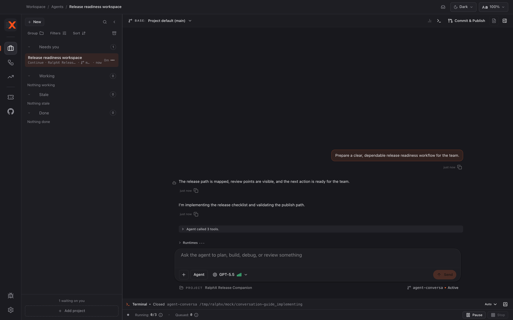

# Implementing a feature with RalphX

Use the direct delivery path to turn an approved plan bundle into a branch with the requested change. You will finish in an **Agent** workspace with the work ready for RalphX's local review gate.

**Before you start:** [Planning a feature with RalphX](planning-a-feature.md)

## Start direct implementation

1. Return to the approved plan bundle in the **Plan** artifact tab.
2. Confirm that the Plan Overview and Implementation Blueprint still describe the work you want done.
3. Click **Implement Directly** to begin the default delivery path.

   This is the longest-running action in these guides. A small, linear change takes several minutes; a plan touching many files can run considerably longer, and it is normal to leave it working and come back.

   It is also the most expensive. Implementation consumes far more provider credits than planning did, because the agent is reading and writing code rather than prose. This is the step to be deliberate about re-running.

4. Wait for the conversation to switch into the **Agent** workspace.
5. Keep the approved artifacts open as the source of intent for the branch.
6. Return to planning instead if you need to change to **Create Proposals** and tracked delivery.

> **Worked example — starting the build.** Continuing the **RalphX Release Companion** feature from [Planning a feature](planning-a-feature.md): with *"Block publishing until the release checklist is complete"* approved, clicking **Implement Directly** moved the conversation into an **Agent** workspace on its own branch.
>
> The plan's "where the gate lives" decision is what the agent implemented against — the check went into the publish action, not the button's disabled state. That is the value of having argued it out during planning: the implementing agent did not have to guess, and you have something specific to check the result against.

## Follow the implementation

1. Read progress updates as RalphX works through the plan.

2. Answer questions that need a product decision or missing context.
3. Give a concrete correction if progress reveals a misunderstanding.
4. Reopen the **Plan** artifact tab to compare progress with the approved intent.
5. Open the **Issues** artifact tab when RalphX identifies a blocker, then resolve it before asking RalphX to finish.
6. Ask RalphX to explain a change when you need to decide whether it still fits the plan.
7. Keep unrelated requests out of this branch.
8. Return to planning if the feature itself must be redefined.

> **Worked example — a correction mid-run.** The progress updates showed the agent adding the gate and also rewording two unrelated checklist labels it happened to pass. That is exactly the moment step 7 exists for. The correction sent into the conversation:
>
> *"Leave the checklist item labels alone — they're out of scope for this change. Keep just the publish gate and the outstanding-items list."*
>
> Small scope drift is normal and cheap to correct while the branch is still open. Left alone it becomes a review finding later, which costs more.

## Stop a run in progress

1. Click **Stop** in the composer to end the run.

   The **Send** button becomes **Stop** while the agent is working, as long as the composer is empty. Clear anything you have typed if you cannot see it.

   Stopping does not discard work. The branch and every file the agent has already changed stay in the workspace exactly as they are — the worktree is a real checkout and stopping a run does not touch it.

2. Decide what to do with the partial branch.

   Send a new message to have the agent carry on from where it stopped, which is usually what you want after a mid-course correction.

   Or open the **Review** artifact tab and treat what exists as the delta to review — a partially implemented plan is still reviewable work, not a broken state.

## Hand off to local review

1. Read RalphX's implementation summary against the approved plan bundle.
2. Check that the summary covers the requested behavior and validation.
3. Resolve any unanswered product question.
4. Open the **Review** artifact tab from the **Agent** workspace.
5. Treat Workspace Review as the local quality gate for the workspace delta, not as a GitHub review.
6. Use review findings to request a fix or decide that the branch is ready to publish.
7. Open **Commit & Publish** only for the later branch hand-off; implementation completion and local review do not publish the branch.

## What you have now

You have an approved plan implemented on a branch in an **Agent** workspace. The direct path produced a workspace delta and a **Commit & Publish** hand-off surface, but the change still needs the local Workspace Review gate before publication.

## Next

- [Reviewing your own work with RalphX](reviewing-your-own-work.md)

If this did not look right — the run stopped early, the branch is missing changes you expected, or the agent could not build the project — see [When something goes wrong](../troubleshooting.md).
