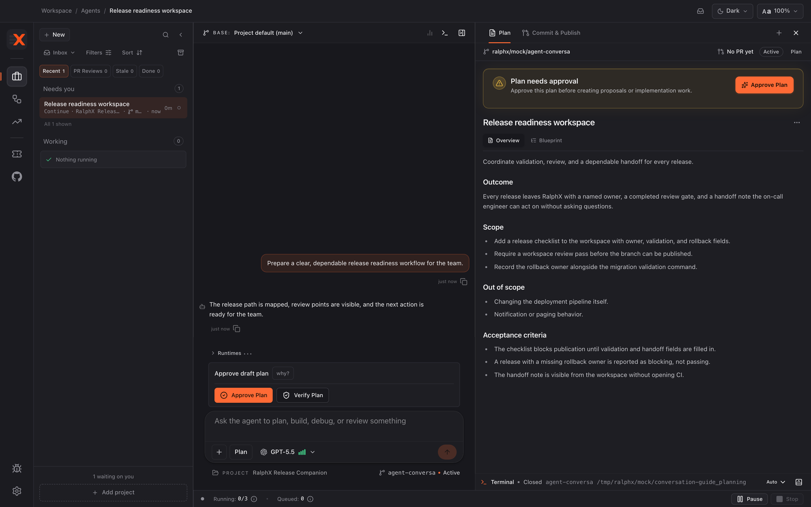

# Planning a feature with RalphX

Use a planning conversation to turn an idea into an implementation-ready *plan bundle* — the Plan Overview and Implementation Blueprint pair described in [RalphX concepts](../concepts.md) — before code changes begin. You will finish with a verified, approved bundle, then choose how to deliver the work.

**Before you start:** [Finding your way around](../02-tour-of-the-app.md)

> **Worked example.** One invented feature runs through all five workflow guides, so you can see the same piece of work from first prompt to merged pull request. The project is **RalphX Release Companion** and the feature is *"Block publishing until the release checklist is complete"*. Neither is real — they are the example, not an instruction.

## Start the planning conversation

1. Open the project you want to change and start a conversation in **Plan**.
2. Describe the outcome, who it helps, relevant existing behavior, and constraints.
3. State what must not change, then send the request.

> **Worked example — the opening prompt.** Typed into the composer of a new **Plan** conversation in **RalphX Release Companion**:
>
> *"Right now anyone can publish a release even when checklist items are still open, and we keep shipping with unfinished sign-off. I want to block publishing until the release checklist is complete, and show which items are outstanding so people know what to finish. Don't change how the checklist itself is edited, and don't touch the existing publish permissions."*
>
> Note what that prompt does: it states the outcome, the reason, and two explicit non-goals. The non-goals matter as much as the goal — they are what stops a plan from growing.

## Clarify the scope

1. Answer each clarifying question with the needed decision or fact.
2. Correct RalphX if it misunderstands the goal or includes work outside the feature.
3. Name compatibility, performance, security, or release constraints that must shape the plan.
4. Give an example when two interpretations would lead to different behavior.

## Read and refine the plan bundle

1. Open the **Plan** artifact tab.
2. Read the Plan Overview for the outcome, scope, and acceptance criteria.
3. Read the Implementation Blueprint for the proposed implementation and validation steps.

4. Return to the conversation to correct missing behavior, remove out-of-scope work, or add a needed acceptance criterion.
5. Re-read both artifacts after a material change.

> **Worked example — what came back.** The Plan Overview for *"Block publishing until the release checklist is complete"* opened with a goal, a scope boundary, and a decision the plan had to make:
>
> *"**Goal.** Publishing is blocked while any checklist item is open, and the publish surface names the outstanding items.*
> *"**Out of scope.** Checklist editing and publish permissions are unchanged.*
> *"**Decision — where the gate lives.** The check belongs in the publish action rather than in the button's disabled state, so an API caller is gated too and not only the UI."*
>
> That third entry is the useful part. A plan that only said "disable the button" would have read fine and shipped a hole. Reading the Overview for the decisions — not just the summary — is what makes this step worth your time.

## Verify and approve the plan

1. Click **Verify Plan** to check that the bundle is safe and complete enough to execute.

   Verification reads the plan against the codebase and argues with it, so expect it to take several minutes on a substantial plan. It is the slowest step in this guide.

   Like every agent action in RalphX, it runs against your own provider account and consumes credits there. Planning is cheap next to implementation, but repeatedly re-verifying an unchanged plan is spend for nothing.

2. Review the verification feedback and resolve any meaningful gap in the conversation.
3. Click **Verify Plan** again after a material revision.
4. Read the final Plan Overview and Implementation Blueprint.
5. Click **Approve Plan** when you are ready to authorize delivery; verification does not approve the plan for you.

   Approval is instant — it records your decision rather than starting work.

## Stop a run you did not mean to start

1. Click **Stop** in the composer while the agent is working.

   The **Send** button becomes **Stop** whenever an agent is running *and* the composer is empty. If you have typed something it stays **Send**, so clear the box to get the **Stop** control back.

   Stopping ends the current run. Anything already written to the conversation and its artifacts stays, and you can send a new message to pick up from there — a stopped planning conversation is not a lost one.

## Choose a delivery path

1. Read the recommendation shown after approval.
2. Choose **Implement Directly** for the default path: a small, linear change implemented and reviewed as one coherent branch.
3. Choose **Create Proposals** when you need tracked tasks or separate review checkpoints.
4. If **Create Proposals** is unavailable, open Settings → **Automation** → **Tasks** and turn on **Enable Tasks**; Tasks is off by default.
5. Return to the approved plan and select the path you want. The recommendation is guidance, not an automatic choice.

## What you have now

You have a verified, approved Plan Overview and Implementation Blueprint, plus an explicit delivery choice. Direct implementation is the normal path for small, linear work; proposals are the tracked-delivery path after you opt into Tasks.

## Next

- [Implementing a feature with RalphX](implementing-a-feature.md)

If this did not look right — verification never finished, the plan came back about the wrong part of the codebase, or the conversation would not start — see [When something goes wrong](../troubleshooting.md).
