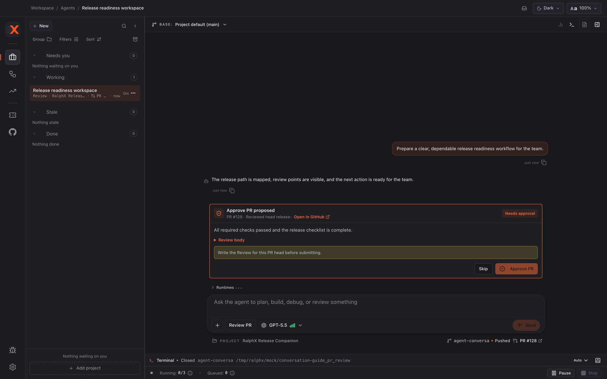

# Reviewing a pull request with RalphX

Use the Review PR workflow to inspect a linked remote GitHub pull request at its current head and decide whether to submit a GitHub review. A GitHub action happens only when you explicitly press its action.

**Before you start:** [Connecting RalphX to GitHub](../integrations/connect-github.md)

## Start a remote pull-request review

1. Complete the GitHub connection prerequisite.
2. Start a conversation in **Review PR** and point RalphX at the pull request you want to inspect.
3. Confirm the selected remote pull request and its current head.
4. Use this workflow for a linked remote PR, not arbitrary local branch changes.

## Inspect the current review

1. Open the **Review** artifact tab for the Review PR workspace.
2. Read the **Review PR monitor** card for the current review state.

3. Use **Review body** to read the review artifact and proposed reasoning.
4. Use **Open in GitHub** when you need the PR discussion, description, or remote metadata.
5. Treat the remote PR head as the version under review.

## Choose an explicit GitHub action

1. Read the findings and proposed action for the current head.
2. Click **Approve PR** only to submit an approval to GitHub.
3. Click **Submit Comment** only to submit the proposed comment to GitHub.
4. Click **Request Changes** only to submit requested changes to GitHub.

5. Click **Skip** when you do not want RalphX to take the proposed action.
6. Nothing reaches GitHub until you press the applicable action.

## Re-review a new head

1. Check the monitor after the PR author pushes a new commit.
2. Read the refreshed **Review body** when **Review PR monitor** reports the new head.
3. Review that current-head result before choosing a new action.
4. Do not submit a proposed action based on an earlier head.

## Control monitoring

1. Turn on **Auto Approve** only when you want RalphX to prepare the monitor's approval behavior; it never removes the explicit submission requirement.
2. Click **Stop Monitoring** to stop new-head re-reviews, or **Restart Monitoring** to resume them.
3. In the stop confirmation, choose **Keep Monitoring**, **Stop After Review**, or **Stop and Cancel Review** according to whether the in-progress review should continue.

## What you have now

You have reviewed a remote GitHub pull request at its current head, with the review state visible in the **Review PR monitor**. Any GitHub approval, comment, or request for changes was submitted only because you explicitly pressed **Approve PR**, **Submit Comment**, or **Request Changes**; otherwise no review action reached GitHub.

## Next

- [RalphX User Guides](../README.md)
