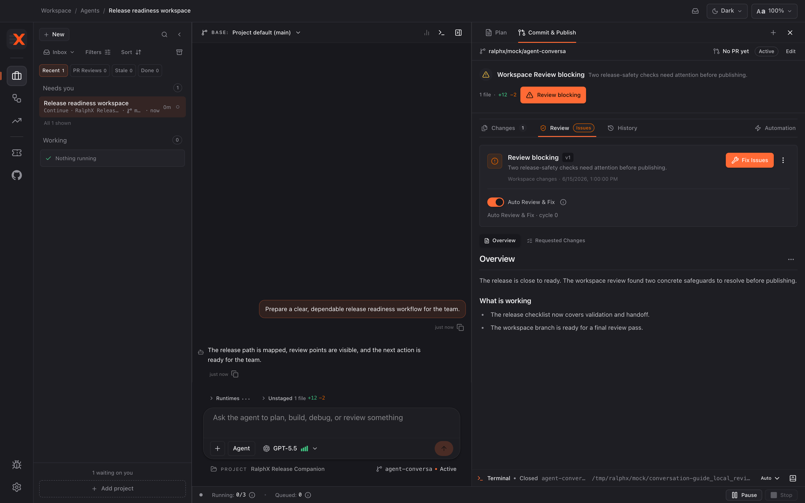
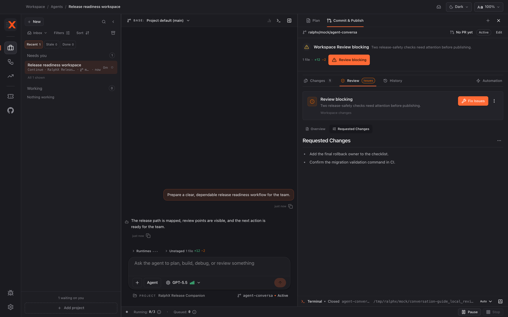
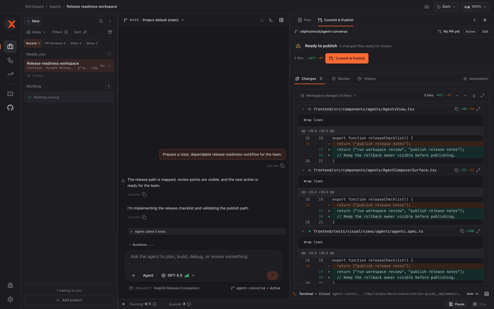

# Reviewing your own work with RalphX

Use Workspace Review to check the local changes RalphX made in your workspace before publishing the branch. You will finish with local findings resolved or consciously overridden, then publish the reviewed branch when you are ready.

**Before you start:** [Implementing a feature with RalphX](implementing-a-feature.md)

## Open the local review gate

1. Open the **Review** artifact tab in the **Agent** workspace after implementation is stable.
2. Use Workspace Review to inspect the local workspace delta against its base before you publish.
3. Treat this as a local quality gate, not a GitHub review.

## Run and read the review

1. Click **Run review** to start a local reviewer pass.

   Expect a few minutes, scaling with the size of the delta rather than the size of the repository. It costs provider credits like any other run, which is worth remembering before clicking **Run again** on an unchanged branch.

   You can stop a review in progress with **Stop** in the composer, the same way you stop any run. The workspace is left as it was and you can start the review again.

2. Use **Retry review** if that attempt needs another run.
3. Open **Overview** for the result and **Requested Changes** for blocking or requested fixes.

4. Compare each finding with the branch changes and approved plan.
5. Click **View transcript** when you need the reviewer's reasoning.

> **Worked example — a real finding.** Reviewing the **RalphX Release Companion** branch for *"Block publishing until the release checklist is complete"*, **Requested Changes** carried one blocking item:
>
> *"The publish action rejects an incomplete checklist, but the outstanding-items list is built from the checklist state loaded when the page rendered. If an item is completed in another tab, the publish attempt is refused and the list shows nothing outstanding. Re-read the checklist at the point of the check."*
>
> This is the kind of finding worth the gate: not a style note, but a stale-read the plan did not anticipate and a quick read of the diff would probably miss. It also shows why step 4 matters — the finding only makes sense held against what the plan said the feature should do.

## Resolve findings

1. Click **Fix Issues** when you want RalphX to address actionable findings in the workspace.
2. Review the fixes against the approved intent.
3. Click **Update review** after the workspace changes and needs a refreshed assessment.
4. Click **Run again** after the fixes settle and you want another full reviewer pass.
5. Repeat until the current local result is acceptable; do not rely on a result from before a material delta change.

## Use an override deliberately

1. Read every blocking finding before considering an override.
2. Click **Approve anyway** only when you consciously accept the remaining blocking findings.
3. Record the reason in the conversation when a future reviewer needs that context.
4. Re-run review instead when the finding can be addressed safely.

## Publish the reviewed branch

1. Confirm that the local review passed or that you consciously used **Approve anyway**.
2. Open the **Commit & Publish** artifact tab and review the branch hand-off information.

3. Publish only when the local review outcome and branch contents are acceptable to you.
4. Use the separate Review PR workflow for a GitHub pull-request review.

> **Worked example — closing the loop.** **Fix Issues** re-read the checklist inside the publish check, **Run again** came back clean, and the **RalphX Release Companion** branch was published. It becomes the pull request in [Reviewing a pull request](reviewing-a-pull-request.md) — the last stop for this example.

## What you have now

You have reviewed the local workspace delta, resolved its findings, or consciously overridden them with **Approve anyway**. The reviewed branch can now be published through **Commit & Publish**; this workflow completed a local quality gate, not a GitHub PR review.

## Next

- [Reviewing a pull request with RalphX](reviewing-a-pull-request.md)

If this did not look right — the review will not start, it keeps reporting the same finding after **Fix Issues**, or publishing fails — see [When something goes wrong](../troubleshooting.md).
